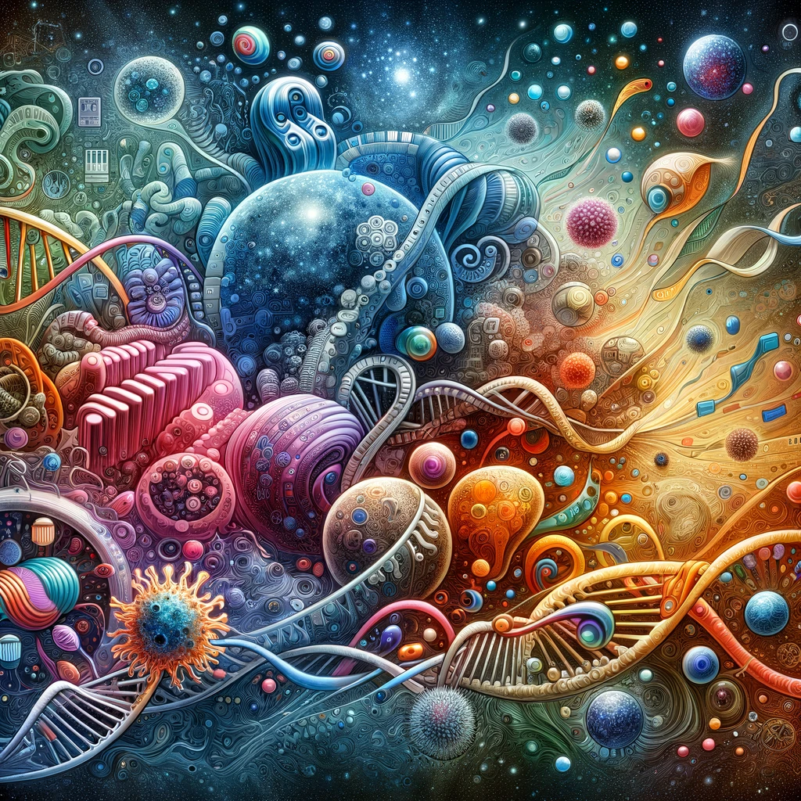

<h1 align="center">
🧬📝 Awesome Bio-Foundation Models
</h1>

  

The repository is a collection of awesome bio-foundation modeling papers, various domains include DNA, RNA, gene, protein, single-cell, and multimodalities.

<pre>🌟 If you'd like to add a paper or resource, feel free to submit a pull request or open an issue.</pre>

  

## Table of Content
- [Table of Content](#table-of-content)
- [Models](#models)
  - [DNA \& Gene](#dna--gene)
  - [RNA](#rna)
  - [Protein](#protein)
  - [Single-cell](#single-cell)
  - [Multimodalities](#multimodalities)
- [Related Resources](#related-resources)
  - [Related Surveys](#related-surveys)
  - [Related Repositories](#related-repositories)
---

## Models
The following logo represents:

 paper publisher with paper link

 code link

 model link

Papers are ranked chronologically.

### <code>DNA & Gene</code>

* **(Enformer) Effective gene expression prediction from sequence by integrating long-range interactions**
  
  
  
  
  
  
* **MoDNA: motif-oriented pre-training for DNA language model**
  
  
  

* **Obtaining genetics insights from deep learning via explainable artificial intelligence**
  
  
  

* **Deciphering microbial gene function using natural language processing**
  
  
  
  
  
  
* **MoDNA: Motif-Oriented Pre-training For DNA Language Model**
  
  
  
  
* **To Transformers and Beyond: Large Language Models for the Genome**
  
  
  
  

* **HyenaDNA: Long-Range Genomic Sequence Modeling at Single Nucleotide Resolution**
  
  
  
  
  
  
  
* **DNABERT: pre-trained Bidirectional Encoder Representations from Transformers model for DNA-language in genome**
  
  
  
  
  
  

* **Species-aware DNA language modeling**
  
  
  
  
  
  
* **DNA language models are powerful predictors of genome-wide variant effects**
  
  
  
  
  

* **GPN-MSA: an alignment-based DNA language model for genome-wide variant effect prediction**
  
  
  
  
  
  
* **GENA-LM: A Family of Open-Source Foundational DNA Language Models for Long Sequences**
  
  
  
  
  
  

* **EpiGePT: a Pretrained Transformer model for epigenomics**
  
  
  
  
  
  

* **DNAGPT: A Generalized Pre-trained Tool for Multiple DNA Sequence Analysis Tasks**
  
  
  
  
  
  

* **The Nucleotide Transformer: Building and Evaluating Robust Foundation Models for Human Genomics**
  
  
  
  
  
  

* **DNABERT-2: Efficient Foundation Model and Benchmark for Multi-Species Genome**
  
  )
  
  
  
  

* **DNABERT-S: Learning Species-Aware DNA Embedding with Genome Foundation Models**
  
  
  
  
  
  

* **Single-cell gene expression prediction from DNA sequence at large contexts**
  
  
  

* **Genomic language model predicts protein co-regulation and function**
  
  
  
  
  
  

### <code>RNA</code>

* **Clustering and classification methods for single-cell RNA-sequencing data**
  
  
  

* **EMDLP: Ensemble multiscale deep learning model for RNA methylation site prediction**
  
  
  
  
  

* **scBERT as a large-scale pretrained deep language model for cell type annotation of single-cell RNA-seq data**
  
  
  
  
  
  

* **(GeneFormer) Transfer learning enables predictions in network biology**
  
  
  
  
  
* **GeneCompass: Deciphering Universal Gene Regulatory Mechanisms with Knowledge-Informed Cross-Species Foundation Model**
  
  
  

* **scPRINT: pre-training on 50 million cells allows robust gene network predictions**

  
  
  

* **scPML: pathway-based multi-view learning for cell type annotation from single-cell RNA-seq data**
  
  
  
  
  

* **(RNA-FM) Interpretable RNA Foundation Model from Unannotated Data for Highly Accurate RNA Structure and Function Predictions**
  
  
  
  
  
  

* **(RNABERT) Informative RNA base embedding for RNA structural alignment and clustering by deep representation learning**
  
  
  
  
  
  

* **(MRM-BERT) Prediction of Multiple Types of RNA Modifications via Biological Language Model**
  
  
  

* **(SpliceBERT) Self-supervised learning on millions of pre-mRNA sequences improves sequence-based RNA splicing prediction**
  
  
  
  
  
  

* **UNI-RNA: universal pre-trained models revolutionize RNA research**
  
  
  

* **A Deep Dive into Single-Cell RNA Sequencing Foundation Models**
  
  
  
  
  
  
* **xTrimoGene: An Efficient and Scalable Representation Learner for Single-Cell RNA-Seq Data**
  
  
  

* **trRosettaRNA: automated prediction of RNA 3D structure with transformer network**
  
  
  

* **(RfamGen) Deep generative design of RNA family sequences**
  
  
  
  
  

* **(RNA-MFM) Multiple sequence alignment-based RNA language model and its application to structural inference**
  
  
  

* **RiNALMo: General-Purpose RNA Language Models Can Generalize Well on Structure Prediction Tasks**
  
  
  
  
  
  

* **ATOM-1: A Foundation Model for RNA Structure and Function Built on Chemical Mapping Data**
  
  
  

* **RNAformer: A Simple Yet Effective Deep LearningModel for RNA Secondary Structure Prediction**
  
  
  
  
  
  

* **scDisInFact: disentangled learning for integration and prediction of multi-batch multi-condition single-cell RNA-sequencing data**
  
  
  
  
  

* **CellPLM: Pre-training of Cell Language Model Beyond Single Cells**
  
  
  
  
 
* **Assessing GPT-4 for cell type annotation in single-cell RNA-seq analysis**
  
  
  
  
  

* **A 5′ UTR language model for decoding untranslated regions of mRNA and function predictions**
  
  
  
  
  

* **ERNIE-RNA: An RNA Language Model with Structure-enhanced Representations**

  
  
  
  

* **GenerRNA: A generative pre-trained language model for de novo RNA design**
  
  )
  
  
  

* **Orthrus: Towards Evolutionary and Functional RNA Foundation Models**

  
  
  
  

### <code>Protein</code>

* **Parapred: antibody paratope prediction using convolutional and recurrent neural networks**
  
  
  
  
  
  
* **(UniRep) Unified rational protein engineering with sequence-based deep representation learning**
  
  
  
  
  

* **(TAPE) Evaluating Protein Transfer Learning with TAPE**

    
  
  
  

* **ProtTrans: Towards Cracking the Language of Life’s Code Through Self-Supervised Deep Learning and High Performance Computing**
  
  
  
  
  
  

* **(ESM) Biological structure and function emerge from scaling unsupervised learning to 250 million protein sequences**
  
  
  
  
  
  

* **(ESM-1v) Language models enable zero-shot prediction of the effects of mutations on protein function**
  
  
  
  
  

* **(IgLM) Generative language modeling for antibody design**
  
  
  
  
  

* **(ESM-2 & ESMFold) Language models of protein sequences at the scale of evolution enable accurate structure prediction**
  
  
  
  
  

* **ProtGPT2 is a deep unsupervised language model for protein design**
  
  
  

* **ProteinBERT: a universal deep-learning model of protein sequence and function**
  
  
  
  
  
  

* **OntoProtein: Protein Pretraining With Gene Ontology Embedding**
  
  
  
  
  
  
* **(AntiBERTa) Deciphering the language of antibodies using self-supervised learning**
  
  00105-2.pdf)
  
  
  
  
* **AbLang: an antibody language model for completing antibody sequences**
  
  
  
  
  
  
* **ProGen2: Exploring the boundaries of protein language models**
  
  
  
  
  

* **SaProt: Protein Language Modeling with Structure-aware Vocabulary**

  
  
  
  
  
  
* **Ankh: Optimized Protein Language Model Unlocks General-Purpose Modelling**

  
  
  
  
  

* **(GearNet) Protein Representation Learning by Geometric Structure Pretraining**
  
  
  

* **ProtST: Multi-Modality Learning of Protein Sequences and Biomedical Texts**
  
  
  
  
  

* **Efficient evolution of human antibodies from general protein language models**
  
  
  
  
  

* **(CARP) Convolutions are competitive with transformers for protein sequence pretraining**
  
  00029-2)
  
  
  

* **(HelixFold-Single) A method for multiple-sequence-alignment-free protein structure prediction using a protein language model**
  
  
  
  
  

* **(ABGNN) Pre-training Antibody Language Models for Antigen-Specific Computational Antibody Design**
  
  
  
  
  
  

* **(ReprogBert) Reprogramming Pretrained Language Models for Antibody Sequence Infilling**
  
  
  
  
  

* **ProteinFlow: a Python Library to Pre-Process Protein Structure Data for Deep Learning Applications**

  
  
  
  

  
* **xTrimoPGLM: Unified 100B-Scale Pre-trained Transformer for Deciphering the Language of Protein**

  
  

* **ProLLaMA: A Protein Large Language Model for Multi-Task Protein Language Processing**
  
  
  
  
  
  

* **(ESM-GearNet) A Systematic Study of Joint Representation Learning on Protein Sequences and Structures**
  
  
  
  
  

* **(ProteinINR) Pre-training Sequence, Structure, and Surface Features for Comprehensive Protein Representation Learning**
  
  
  
  
 

* **(CaLM) Codon language embeddings provide strong signals for use in protein engineering**
  
  
  
  
  

* **(DeepGo) Protein function prediction as approximate semantic entailment**
  
  
  
  
  

* **PLMSearch: Protein language model powers accurate and fast sequence search for remote homology**
  
  
  
  
  

* **Genomic language model predicts protein co-regulation and function**
  
  
  
  
  
  

* **Prot2Token: A multi-task framework for protein language processing using autoregressive language modeling**
  
  
  
  
  

* **(ESM-3) Simulating 500 million years of evolution with a language model**
  
  
  
  
  

* **Training Compute-Optimal Protein Language Models**
  
  
  

* **Fine-tuning protein language models boosts predictions across diverse tasks**
  
  
  
  
  

* **Contextual AI models for single-cell protein biology**
  
  
  
  
  
  
* **Sequence-to-sequence translation from mass spectra to peptides with a transformer model**
  
  
  
  
  

* **OpenFold: retraining AlphaFold2 yields new insights into its learning mechanisms and capacity for generalization**
  
  
  
  
  

* **ProteinInvBench: Benchmarking Protein Inverse Folding on Diverse Tasks, Models, and Metrics**
  
  
  
  
  

* **ProteinShake: Building datasets and benchmarks for deep learning on protein structures**
  
  
  
  
  

* **ProteinBench: A Holistic Evaluation of Protein Foundation Models**
  
  
  
  

* **An end-to-end framework for the prediction of protein structure and fitness from single sequence**
  
  
  
  
  

* **SFM-Protein: Integrative Co-evolutionary Pre-training for Advanced Protein Sequence Representation**

  
  

* **(BioEmu-1) Scalable emulation of protein equilibrium ensembles with generative deep learning**
  
  
  
  
  

* **(Evolla) Decoding the Molecular Language of Proteins with Evolla**

  
  
  
  

* **Protrek: Navigating the protein universe through tri-modal contrastive learning**

  
  
  
  
  
  
***Protein foundation models are hot topics, more papers can be found in***
- [Machine-Learning-for-Proteins](https://github.com/yangkky/Machine-learning-for-proteins)
- [Awesome-Protein-Representation-Learning](https://github.com/LirongWu/awesome-protein-representation-learning)

### <code>Single-cell</code>

* **(DCell) Using deep learning to model the hierarchical structure and function of a cell**
  
  
  
  
  

* **scVAE: variational auto-encoders for single-cell gene expression data**
  
  
  
  
  

* **A sandbox for prediction and integration of DNA, RNA, and proteins in single cells**
  
  
  
  
* **scBERT as a large-scale pretrained deep language model for cell type annotation of single-cell RNA-seq data**
  
  
  
  
  
  

* **scPML: pathway-based multi-view learning for cell type annotation from single-cell RNA-seq data**
  
  
  
  
  

* **(scFoundation) Large Scale Foundation Model on Single-cell Transcriptomics**
  
  
  
  
  
  

* **(DPI) Modeling and analyzing single-cell multimodal data with deep parametric inference**
  
  
  
  
  

* **(ScPROTEIN) A Versatile Deep Graph Contrastive Learning Framework for Single-cell Proteomics Embedding**
  
  
  
  
  
  

* **scGPT: toward building a foundation model for single-cell multi-omics using generative AI**
  
  
  
  
  
  

* **scMulan: a multitask generative pre-trained language model for single-cell analysis**
  
  
  
  
  
  

* **scDiffusion: conditional generation of high-quality single-cell data using diffusion model**
  
  
  
  
  
  

* **Cell2Sentence: Teaching Large Language Models the Language of Biology**
  
  
  
  
  

* **CellPLM: Pre-training of Cell Language Model Beyond Single Cells**
  
  
  
  
  

* **Assessing GPT-4 for cell type annotation in single-cell RNA-seq analysis**
  
  
  
  
  

  

### <code>Multimodalities</code>

* **(DPI) Modeling and analyzing single-cell multimodal data with deep parametric inference**
  
  
  
  
  

* **Pretraining model for biological sequence data**
  
  
  

* **BioSeq-BLM: a platform for analyzing DNA, RNA and protein sequences based on biological language models**
  
  
  

* **A sandbox for prediction and integration of DNA, RNA, and proteins in single cells**
  
  
  

* **Galactica: A Large Language Model for Science**
  
  
  
  
  
  

* **BioT5: Enriching Cross-modal Integration in Biology with Chemical Knowledge and Natural Language Associations**
  
  
  
  
  
  

* **DARWIN Series: Domain Specific Large Language Models for Natural Science**
  
  
  
  
  
  

* **(scMoFormer) Single-Cell Multimodal Prediction via Transformers**
  
  
  
  
  

* **BioT5+: Towards Generalized Biological Understanding with IUPAC Integration and Multi-task Tuning**
  
  
  
  
  
  

* **ChatCell: Facilitating Single-Cell Analysis with Natural Language**
  
  
  
  
  
  

* **(Evo) Sequence modeling and design from molecular to genome scale with Evo**
  
  
  
  
  
  

* **NatureLM: Deciphering the Language of Nature for Scientific Discovery**
  
  
  
  

* **Genome modeling and design across all domains of life with Evo 2**
  
  
  
  

## Related Resources

### <code>Related Surveys</code>

* **Learning the protein language: Evolution, structure, and function**
  
  00203-9.pdf)
  

* **Protein Language Models and Structure Prediction: Connection and Progression**
  
  
  

* **Progress and Opportunities of Foundation Models in Bioinformatics**
  
  
  

* **Deep Learning for Genomics: From Early Neural Nets to Modern Large Language Models**
  
  
  

* **Applications of transformer-based language models in bioinformatics: a survey**
  
  
  

* **Best practices for single-cell analysis across modalities**
  
  
  

* **Domain Specialization as the Key to Make Large Language Models Disruptive: A Comprehensive Survey**
  
  
  

* **Scientific Large Language Models: A Survey on Biological & Chemical Domains**
  
  
  

* **Large language models in bioinformatics: applications and perspectives**
  
  
  

* **Leveraging Biomolecule and Natural Language through Multi-Modal Learning: A Survey**
  
  
  

* **Machine learning for functional protein design**

  
  

### <code>Related Repositories</code>
* [Machine-Learning-for-Proteins](https://github.com/yangkky/Machine-learning-for-proteins)
* [Scientific-Large-Language-Models](https://github.com/HICAI-ZJU/Scientific-LLM-Survey/tree/main)
* [Awesome-Scientific-Language-Models](https://github.com/yuzhimanhua/Awesome-Scientific-Language-Models)
* [Awesome-Biomolecule-Language-Cross-Modeling](https://github.com/QizhiPei/Awesome-Biomolecule-Language-Cross-Modeling)
* [Awesome-Deep-Learning-Single-Cell-Papers](https://github.com/OmicsML/awesome-deep-learning-single-cell-papers)
* [Awesome-Protein-Representation-Learning](https://github.com/LirongWu/awesome-protein-representation-learning)
* [Awesome-Molecule-Protein-Pretrain-Papers](https://github.com/OmicsML/awesome-molecule-protein-pretrain-papers)
* [Awesome-Pretrain-on-Molecules](https://github.com/junxia97/awesome-pretrain-on-molecules)
* [Awesome-Molecule-Text](https://github.com/Namkyeong/awesome-molecule-text)
* [Aswesome-Deep-Learing-for-Life-Sciences](https://github.com/virtualramblas/awesome-deep-learning-4-life-sciences)
* [Awesome-Docking](https://github.com/KyGao/awesome-docking)
* [Awesome-Biology](https://github.com/raivivek/awesome-biology)
* [Awesome-Single-Cell](https://github.com/seandavi/awesome-single-cell)
* [Awesome-Computational-Biology](https://github.com/inoue0426/awesome-computational-biology)
* [Awesome-Multi-Omics](https://github.com/mikelove/awesome-multi-omics)
* [LLM4ScientificDiscovery](https://github.com/microsoft/LLM4ScientificDiscovery)
* [Awesome-Bioinformatics](https://github.com/danielecook/Awesome-Bioinformatics)

